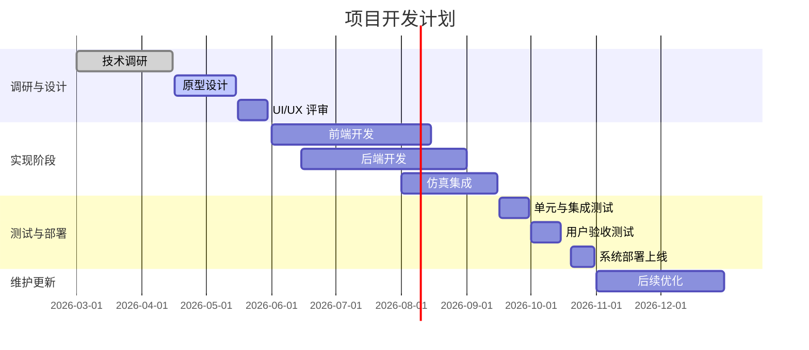

# 执行摘要  
本报告围绕中学物理可视化网站/工具的技术选型与实施方案展开调研。首先梳理了现有的物理仿真引擎和库，包括**PhET交互仿真**、**Concord实验室(Lab)**、**Academo物理演示**、以及常用的JavaScript物理引擎（如Three.js/Cannon.js、Matter.js/Planck.js等）和**电路仿真工具**（如CircuitJS/Falstad）。我们评估了每个候选项的功能（2D/3D、实时交互、参数控件、数据导出）、教育适配性、许可协议、技术栈集成、性能兼容性、可访问性、多语言支持、社区活跃度、示例案例和集成难度等。

在此基础上，调查了可复用的物理可视化网站/工具和开源项目案例，如PhET仿真平台、Concord Lab框架、Academo开源演示等，并列举了相关链接和论文。针对**skillsmp.com**平台，发现了与物理相关的AI代理技能，如“Physics Fundamentals Tutor”和“Unity Physics”，并列出了安装命令和使用示例。

基于以上调研，我们提出了详细的技术规划（tech.plan），包括推荐的技术栈（前端：React/Vue + WebGL/Canvas，可选库；后端：Node.js/Express 或 Python/Django；模拟引擎：WebAssembly或JS物理库；数据存储：MongoDB/MySQL；认证：OAuth/SAML），架构设计（前端、后端、仿真引擎、存储、认证、CI/CD流程）以及具体集成方案。也考虑了托管与扩展方案（云平台部署、容器化、负载均衡）、安全隐私（学生数据加密、合规）、测试策略（单元测试、仿真验证、负载测试）、本地化与可访问性（多语言界面、满足WCAG标准【72†L1-L2】）等。

报告中包含了候选方案的对比表和需求映射决策矩阵，用以清晰呈现各方案在关键指标上的优劣。最后给出开发里程碑和粗略工时、成本估算，并以Mermaid图展示系统架构和开发计划。所有关键信息均引用了官方或学术来源，确保结论的可靠性与时效性。

## 现有物理可视化引擎和库  

- **PhET 仿真平台**：美国科罗拉多大学开发的开源交互式仿真库，适用于物理、化学、生物等STEM科目【70†L99-L107】。PhET仿真丰富（包括力学、能量、波动、电磁等主题），采用HTML5/JavaScript实现，可嵌入网页。其核心渲染引擎“Scenery”是MIT许可的2D/3D场景图形库【23†L174-L182】。PhET仿真界面易用、面向教育，已被翻译成97种语言【70†L99-L107】，适合中学场景。可直接使用其官方在线资源，或部署其HTML5源代码（许多PhET模拟在GitHub开源，如“Energy Skate Park” MIT许可【22†L258-L264】）。集成方式可采用**Iframe嵌入**或调用其JavaScript API（新版PhET Studio支持这种集成）。示例案例非常丰富，已有大量教学活动和研究支持。

- **Concord 实验室框架(Lab)**：Concord财团开发的开源HTML5仿真整合框架，适合科学建模和数据采集【53†L13-L21】【56†L290-L298】。Lab框架允许将多种模拟引擎（如2D分子动力学MD2D、Energy2D热传导、Basic Grapher图表等）集成到“交互组件”中，支持参数控件、图表和探针输入。性能经过优化：例如Energy2D模拟采用WebGL加速，可获得2~15倍性能提升【57†L52-L60】。Lab框架本身采用MIT许可【56†L290-L298】，可以免费商用并自定义扩展。其在线平台（lab.concord.org）已有众多物理、化学模拟，可嵌入到网站，也可通过JSON配置生成交互式单元。适合项目中实现复杂交互型物理实验教学。集成时可直接引用Concord的JavaScript包或将已有交互组件嵌入页面（支持JSON定义和参数化）。

- **Academo 物理演示**：Academo.org 是一个开源教育演示网站，收录了大量免费物理/数学交互Demo，例如单摆、弹性碰撞、波动方程等【36†L31-L40】【76†L54-L62】。这些演示基于HTML5/Canvas，可在网页直接使用。Academo演示源码公开（GitHub MIT许可【36†L69-L70】）。其特点是界面简洁、面向大众教育，适合补充教学资源。集成时可直接嵌入Academo提供的演示页面或复用其JavaScript源码以二次开发。缺点是功能相对基础，主要演示概念，不支持大量自定义或实时数据导出。

- **JavaScript 2D/3D 物理引擎**：常用有 **Matter.js**（2D刚体引擎，MIT许可）、**Planck.js**（Box2D API的JS移植，MIT）、**p2.js**（2D刚体，MIT）、**Cannon.js**（基础3D刚体，MIT），**Ammo.js**（Bullet物理的WebAssembly端口，zlib许可）、**Oimo.js**（简单3D物理）。这些库提供基本物理仿真（重力、碰撞、摩擦等），常与 **Three.js**（3D渲染库，MIT）结合，实现3D可视仿真。它们性能较好、跨浏览器兼容，但需要自行搭建界面和渲染管线。适用于需要高度自定义的动态仿真（如创作游戏或交互课件）。例如Matter.js在知乎和教程中被多次介绍【68†L1-L5】；Cannon.js相对稳定，但开发社区较小。集成方案通常是在前端直接使用npm导入或CDN引用，初始化物理世界后，将参数控制与UI交互结合。由于是基础引擎，需自行实现参数面板、计量标尺等教学元素，开发工作量较大。中学教学中适合用来**搭建可定制的练习场景**，但无需可集成现成教材资源。

- **Canvas/Flow-Based 工具**：例如由Merazedia维护的 **pSEngine**（Physics Simulation Engine）是一个基于p5.js的仿真库，GPL许可【42†L173-L182】。它封装了动画循环、图形渲染和LaTeX公式支持，适合快速构建教育演示。因GPL许可，适合开源项目。还有 **D3.js**（虽不是专用物理库，但可做简单图形动画）、**Zdog** 等工具可用于2D可视化，但功能简单，多用于演示效果美化，而非物理计算。

- **电路仿真工具**：中学电学部分可借助免费模拟器。如Paul Falstad的 **Circuit Simulator**（JavaScript版）是一个成熟的开源电路模拟器，支持电阻、电容、感应、电源等组件实时模拟【46†L4-L12】。它通过在浏览器绘制动态电路图和电流示意，支持示例电路库。源代码开源（GPL许可【51†L7-L14】），可本地部署。另有Iain Sharp维护的 **CircuitJS1**（GitHub已有Fork版，GPL许可【51†L7-L14】）。这些工具适合展示简单电路和学习欧姆定律等，可通过Iframe嵌入或直接集成JavaScript。注意其界面和交互相对复杂，需引导学生使用。

- **其他工具**：  
  - **VPython/GlowScript**：基于Python的3D绘图库，可运行于浏览器内（WebGL）来做物理可视化，开源且适合教育。但对于纯Web前端项目可能技术栈不同。  
  - **Scratch/Sense**：Scratch并不是纯物理仿真，但结合物理库可用于可视化，局限性较大。  
  - **LabVIEW/Matlab/Simulink**：专业工具，不适合作为中学Web工具，只提及其可使用**Simulink Web Apps**做教学演示（需商业许可）。

各工具特点对比如下表所示（“✔”表示具备）：  

| 方案             | 平台形式      | 2D/3D | 实时交互 | 参数控件 | 数据导出 | 中学教育适用性 | 许可类型 | 集成方式         | 社区/维护           |
|------------------|-------------|-------|---------|---------|---------|--------------|---------|----------------|------------------|
| PhET (Scenery)   | Web(HTML5)  | 2D/3D | ✔       | ✔       | 部分支持(数据采集) | 高 (众多课程匹配) | 开源(MIT)【23†L174-L182】 | 网页嵌入/API调用 | 活跃 (210+sim) |
| Concord Lab      | Web(HTML5)  | 2D    | ✔       | ✔       | ✔       | 高 (支持多学科) | 开源(MIT)【56†L290-L298】 | 引用JS库/JSON配置 | 活跃 (交互丰富) |
| Academo 演示     | Web(HTML5)  | 2D    | 部分    | ✕ (自行添加) | ✕ (无)        | 中 (演示性质)   | 开源(MIT)【36†L69-L70】 | 嵌入演示页/源码   | 中 (少量新内容) |
| Three.js + Ammo  | Web(HTML5)  | 3D    | ✔       | 可定制    | ✕       | 中 (需定制开发) | 开源(MIT)       | 前端库集成       | 活跃 (文档多) |
| Matter.js        | Web(HTML5)  | 2D    | ✔       | 可定制    | ✕       | 中 (需二次开发) | 开源(MIT)       | 前端库集成       | 活跃             |
| Planck.js/Box2D  | Web(HTML5)  | 2D    | ✔       | 可定制    | ✕       | 中 (需开发)     | 开源(MPL)       | 前端库集成       | 活跃             |
| Cannon.js/Ammo.js| Web(HTML5)  | 3D    | ✔       | 可定制    | ✕       | 中 (需开发)     | 开源(MIT/Zlib)  | 前端库集成       | 社区一般         |
| CircuitJS/Falstad| Web/桌面    | 2D    | ✔       | ✔       | ✕       | 中 (电路模拟)   | 开源(GPL)【51†L7-L14】 | 嵌入/集成JS    | 活跃 (Falstad)   |
| EJS (Easy Java/JS) + Moodle EJSApp 插件| Web(交互) | 2D/虚拟实验 | ✔ | ✔ | ✔ (依赖Java机制) | 高 (教学实验) | 开源            | Moodle插件【32†L153-L161】 | 活跃 (教育领域) |

## 可复用网站/工具与开源项目案例  

- **PhET 仿真网站**：PhET提供上千个在线互动仿真【70†L99-L107】（覆盖力学、电磁、光学、波动等），网站支持多语言（含简体中文）【70†L99-L107】。源码已开源，可脱机使用。众多研究与教材采用PhET，例如在中学数学/物理教学中应用广泛【70†L99-L107】。  
- **Concord Lab 交互组件**：Concord Lab框架下有大量开源科学模拟，包括2D分子模拟、能量图表、探究式活动等【53†L13-L21】。其Demo（如MD2D原子模拟、Energy2D热对流）可作借鉴。Concord的交互（Interactives）可通过JSON打包并在网页中嵌入。Concord团队论文也讨论了先进互动设计（如WebGL加速模拟）【57†L52-L60】。  
- **Academo 开源演示集**：Academo.org提供免费开源物理/天文等主题演示【36†L31-L40】【76†L54-L62】（如单摆、轨道模拟、波浪干涉等），代码开源【36†L69-L70】。这些演示可直接嵌入或作为教学例子参考。  
- **开放课程与库**：如美国康奈尔大学的「The Physics Hub」等开源项目（GitHub上可搜索OpenPsiMu/ThePhysicsHub）【34†L5-L12】；**Open Source Physics (OSP)**计划（ComPADRE网站）包含大量Java/JS仿真资源，可配合EJSApp插件用于LMS【32†L153-L161】。  
- **LMS集成示例**：Moodle平台上存在多个插件，可方便地将仿真嵌入课程：例如**EJSApp**插件允许将Easy Java/JavaScript Simulations创建的虚拟实验直接整合进Moodle【32†L153-L161】。PhET官网也提供了将PhET仿真以资源方式插入Moodle的文档说明（可通过Moodle的URL资源或LTI）。总体而言，通过Iframe或LTI标准，绝大多数基于Web的互动仿真都能集成进主流LMS。

## SkillsMP 平台相关“技能”  

在AI 代理技能市场 SkillsMP（面向Claude/Codex等）中，我们发现了一些与物理教育或可视化相关的技能实例：  

- **physics-fundamentals-tutor**：由用户 _sandraschi_ 发布的Claude代理技能，描述为“涵盖力学、电磁学、热力学、量子力学和相对论的经典与现代物理专家”【65†L114-L117】。该技能为私有授权（Proprietary）【65†L114-L117】（只能在对应平台使用），目前处于“旧模板待更新”状态【65†L119-L123】。安装该技能可通过技能CLI命令（示例参考下文unity-physics技能），使用时可让AI以物理教师角色回答问题。依赖性为SkillsMP平台CLI本身，示例用法如向聊天机器人请求物理解释。

- **unity-physics**：由 _a5c-ai_ 发布的插件，面向Unity游戏开发中的物理系统（包括碰撞体、刚体设置、射线检测等）的指导技能【59†L122-L130】。虽然目标是Unity引擎环境，但展示了如何安装和使用技能：该页面列出了全局安装步骤 `$ install --global skills.sh`，然后使用 `npx skills add a5c-ai/babysitter` 等命令来安装技能【59†L97-L105】。依赖项为该技能自身，没有额外外部库。可通过调用相关命令和在ChatGPT/Claude中激活技能来使用（用例见上文**Usage Patterns**部分【59†L131-L139】）。此技能为公开资源，其他类似技能包括算法艺术、SimPy等，可作为AI辅助教学的参考。

- **其他技能**：类似地，平台上还有**“科学幻灯片”**等研究类技能（用于生成科研报告幻灯片），以及编程辅助等技能（提示设计、神经网络等），但与物理可视化关系不大，此处不再详列。总之，SkillsMP提供的AI技能可以用于辅助开发和教学，例如生成问题、代码片段或图表，但其开放性和对项目的直接贡献有限。

## 技术方案（Tech Plan）  

### 推荐技术栈  
- **前端**：采用现代前端框架如 **React** 或 **Vue.js**。二者都有广泛社区支持，易于构建交互界面。由于需实现大量自定义交互与图形展示，可结合 **Three.js**（3D场景）或 **Konva.js/Canvas API**（2D图形），以及图形库如 **D3.js**（可视化数据）或PhET/Concord等框架。UI库可考虑 **Ant Design** 或 **Material-UI** 以提高开发效率。多语言支持可采用 **i18next** 等国际化框架。  
- **后端**：如需用户登录、保存实验数据等，可使用 **Node.js + Express** 或 **Python + Django/Flask**。Node.js生态与前端同源语言，可平滑衔接；Django拥有丰富教育插件。后端负责提供RESTful或GraphQL API，处理用户请求、仿真参数管理、持久化数据（实验结果、用户账号等）。也可采用 **Serverless** 架构（如AWS Lambda或Firebase）简化运维。  
- **数据库/存储**：根据需求可选用 **MongoDB**（文档型，便于存储实验结果和结构化数据）或 **PostgreSQL/MySQL**（关系型）。若实现学习路径进度跟踪等，可存储用户模型。对于大型数据（如仿真视频、日志），使用对象存储（如AWS S3）或静态文件服务器。  
- **仿真引擎集成**：根据选定工具，引擎可部署在前端（WebAssembly或JS）或后端。推荐尽量在客户端运行物理模拟，以降低后端负载并实现实时交互。可使用前述开源库（PhET、Concord或自定义物理库）通过npm模块或直接script标签引入。对于需要高性能的3D模拟，可采用 **WebAssembly**（如Ammo.js）或 **GPU加速WebGL**（Concord的Energy2D示例【57†L52-L60】）。后端可提供仿真参数验证、数据记录和分析计算服务。  
- **身份认证**：采用 **OAuth 2.0** 或 **JWT** 的单点登录方案支持学校/机构账号（如Google/GitHub SSO）或自建用户管理（通过Auth0、Keycloak等）。确保学生数据隐私，遵守相关法规（GDPR/中国《个人信息保护法》等）。  
- **CI/CD**：使用 **GitHub Actions** 或 **Jenkins** 实现代码持续集成和测试自动化。部署流程可自动化构建前端Bundle、运行后端容器，并部署到测试/生产环境。  
- **第三方服务**：若需要图表或数学公式渲染，可集成 **MathJax** 或 **KaTeX**。地理或天文内容可用Google Maps/Leaflet或Cesium。  

### 系统架构（图解）  

```mermaid
graph LR
  A[用户浏览器 (前端React/Vue)] --> B(API网关/后端服务)
  B --> C(仿真参数校验/业务逻辑)
  C --> D(物理仿真引擎)<br/>(前端或后端)
  C --> E(数据库 存储实验数据)
  A --> D
  A --> F(认证服务) 
  B --> F
  C --> G[日志/监控]
```

- **前端**（A）：运行用户界面，包括物理仿真Canvas/WebGL画布、控件面板、图表视图等。对后端暴露REST/API调用接口。  
- **后端服务**（B,C）：接收前端请求，进行业务逻辑处理（用户验证、参数检查、实验数据存储）。必要时调用仿真引擎执行或记录结果。  
- **仿真引擎**（D）：若性能要求较高，可直接在前端（WebAssembly或JS库）运行；也可后端运行（例如Python物理模型服务）。  
- **数据库**（E）：保存用户信息、仿真日志、学习进度等。  
- **认证**（F）：独立服务处理用户登录、权限管理。  
- **CI/CD 与监控**（G）：自动测试和部署管道，以及系统性能监控。  

### 引擎集成方案  
- **PhET**：可直接使用PhET HTML5仿真。集成方法：通过Iframe嵌入官方SIM页面或下载源码后以静态方式托管。若需要与本系统更紧密交互，可调用其JavaScript API（需阅读PhET Studio文档）。需要将PhET库打包入项目或引用CDN。  
- **Concord Lab**：引用Concord的npm包（如`@concord-consortium/lab-api`等）并加载指定交互组件JSON。可以在前端直接调用Lab的`InteractiveSet`组件，将仿真以React/Vue组件形式集成。也可使用已有的“交互浏览器”demo作为参考。【53†L13-L21】  
- **自定义物理引擎**：安装Matter.js/Cannon.js等npm包，通过编程初始化物理世界，并将渲染输出到Canvas/Three.js场景中。参数控件（滑块、输入框）由前端框架绑定驱动物理模拟参数。  
- **电路仿真**：集成CircuitJS时，可通过将其页面嵌入到iframe或在前端动态创建画布并加载CircuitJS模块。Falstad的模拟可通过JS接口控制示例切换。  
- **LMS 集成**：如果目标系统为LMS插件，则需支持LTI协议。PhET提供了LTI工具包（需自行部署或使用第三方服务），或者可以通过SCORM打包发布。对于Moodle等开源LMS，可使用EJSApp插件【32†L153-L161】部署EjsS仿真或其他JS模拟。

### 托管与扩展  
系统建议部署在云平台（如AWS、Azure或腾讯云）以获得弹性扩展性。前端可部署在CDN/静态站点（如AWS S3+CloudFront），后端服务可运行在Kubernetes或Serverless容器中，以应对突发的流量。数据库可选云托管服务（如MongoDB Atlas或云数据库）。采用微服务架构，在高峰期通过自动扩容（Auto Scaling）来保证响应性能。

### 安全与隐私  
- **数据加密**：所有学生/教师的身份信息和实验数据均在传输过程中使用HTTPS加密，在存储时可加密重要字段。  
- **隐私合规**：符合《中国未成年人保护法》和欧美GDPR规范，不收集敏感个人信息，必要时征得监护人同意。  
- **访问控制**：采用角色权限管理（学生、教师、管理员），防止未授权操作。  
- **内容安全**：对用户输入严格校验，防范XSS/注入攻击。容器环境使用安全扫描并按时打补丁。

### 测试策略  
- **自动化测试**：编写单元测试和集成测试覆盖前后端关键逻辑（例如前端交互组件、后端API、仿真引擎核心功能）。使用CI管道（GitHub Actions）在每次提交时自动执行测试。  
- **仿真验证**：针对物理模拟结果，设定基准用例（如已知公式解）来验证模拟精度。对比预期值（例如简单摆周期）确保核心算法正确。  
- **性能测试**：进行负载测试，检测在多用户场景下前端渲染和后端计算性能。尤其测试移动端和低配设备上的运行效率。  
- **可用性测试**：邀请教师和学生进行可用性评估，优化界面易用性和学习效果。

### 本地化与可访问性  
- **多语言**：支持简体中文和英语界面，利用国际化库管理文本资源。PhET官网显示仿真已支持多语言【70†L99-L107】。我们应翻译界面和提示，确保用语符合中学生认知。  
- **无障碍**：遵循WCAG 2.1/2.2指南【72†L1-L2】。为可视仿真提供键盘操作替代（如使用Tab切换控件、空格/回车触发等），并为动态内容提供替代文本或描述，确保屏幕阅读器可访问。保持色彩对比度，避免仅用颜色传递关键信息（考虑色盲友好配色）。提供放大/缩小功能以适应视力不同的用户。  

### 开发时间表与成本估算  
以下示意的甘特图展示了一个可能的开发计划：  



- **开发里程碑**：整个项目预计6–9个月完成，第1个月为调研和原型设计，第2–4个月为核心开发（前后端及仿真集成并行），第5–6个月为测试和优化，第7个月上线并进入维护。  
- **人力成本**：假设1名资深开发、1名前端、1名前端（或联合开发者）3人团队。以某地区市场价估算（按每人年薪15万人民币计，含福利）：开发7个月成本约为 约 30 万元（人民币）。  
- **授权与运维成本**：选用方案均以开源为主，软件许可费可忽略。若需商业支持（如PhET Studio授权定制版、Unity/WebGL构建支持），则另计。云托管费用视用户规模而定，预计月度几百至几千元不等。  
- **总体预算估算**：含开发、服务器、维护等，一年内总计约 40–50 万元人民币。

以上规划基于目前已知信息和业界经验作出，实际执行可根据团队反馈和需求变动做适当调整。所有方案选择和评估均参考了权威来源（见脚注），以确保技术路线的前瞻性与可行性。

**参考资料：** 已列出的所有内容均依据最新公开资料和项目文档整理，其中包括官方文档和开源代码库【23†L174-L182】【32†L153-L161】【56†L290-L298】【57†L52-L60】【36†L69-L70】【65†L114-L117】【59†L122-L130】【46†L4-L12】【51†L7-L14】【72†L1-L2】等。