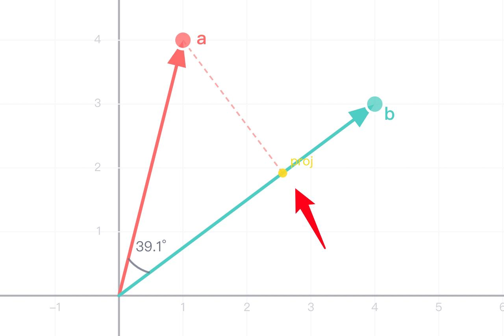
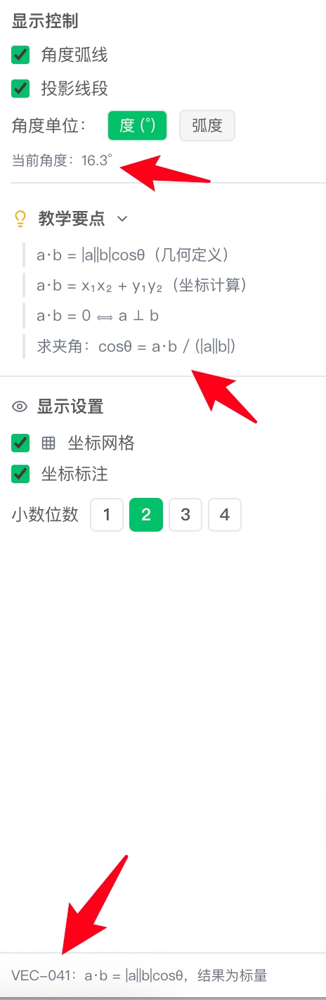

V0.1 反馈意见
1、向量坐标无法设置根号
2、首尾相接功能，底下这两个和最上面那个区别不大（封闭三角形，直角三角形功能有点鸡肋）
3、演示台应该增加一些动的向量（比如说固定起点，模长为1的向量）
4、数量积没有太起到演示的功能（感觉上就是坐标运算），没有抓住学生痛点。可以适当增加一些数量积运算的方法（极化恒等式，投影等）
团队内部反馈意见
1、投影的文字看不清，图中箭头的地方
2、坐标系中的向量，不同向量是用不同颜色好，还是统一用黑色，可能要评估一下
3、有些文字太小了，看不清

m05 06
都有一种老人手机的感觉，就是图表或者坐标区域特别大
感觉默认可以小一些

